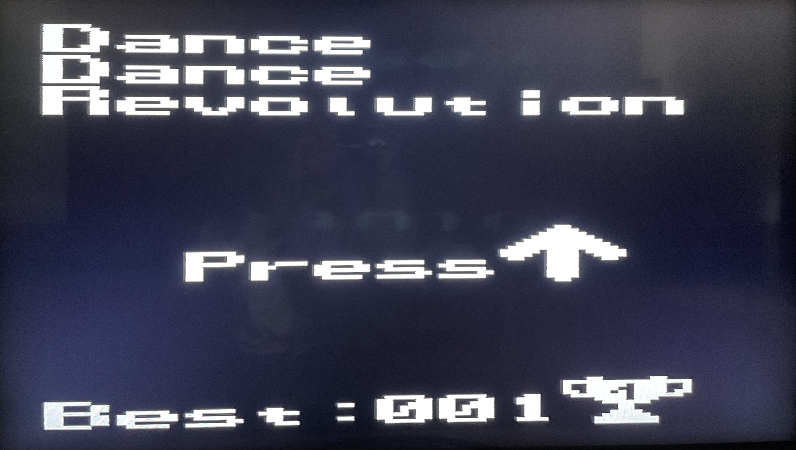
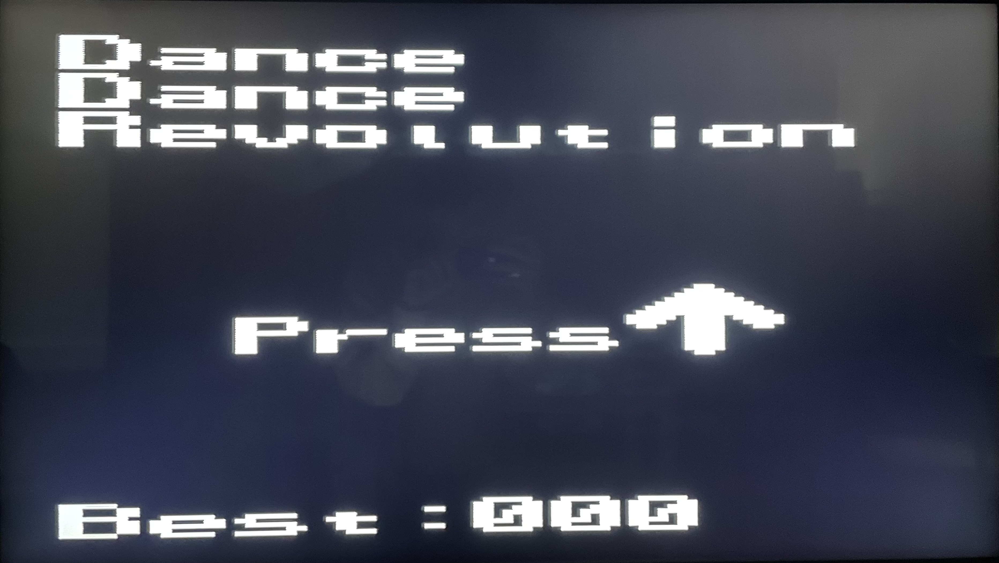
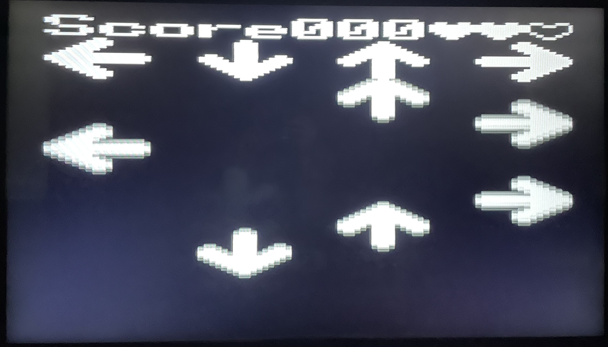

# 🎮 Dance dance revolution game written in pure assembly!


<div style="display: flex; justify-content: space-around; align-items: center;">
  
</div>

## Summary
1. [Quick presentation](#quick-presentation)
2. [Results illustrated](#results-illustrated)
3. [Test it](#test-it)
4. [Improvements](#improvements)
5. [Credits](#credits)

## Quick presentation

Disclaimer : It is recommended to take a look the `electrical_schematic.pdf` and `report.pdf` for detailed explanations.

This project is a simple remake of the famous [Dance Dance Revoluation game](https://fr.wikipedia.org/wiki/Dance_Dance_Revolution) from Konami.<br>
The project is designed for the [PIC16F1789](https://ww1.microchip.com/downloads/aemDocuments/documents/OTH/ProductDocuments/DataSheets/40001675C.pdf).<br>
The project was developped using [MPLAB X IDE](https://www.microchip.com/en-us/tools-resources/develop/mplab-x-ide) and picas, documentation [here](https://ww1.microchip.com/downloads/aemDocuments/documents/DEV/ProductDocuments/UserGuides/MPLAB-XC8-PIC-Assembler-User-Guide-50002974.pdf).

It comes with :
- A definition of 104x144 pixels (up to 416x576 pixels with enough RAM).
- A menu with a "High score".
- 1 map with 1 song.
- The possiblity to easily add new songs in `music.s` to be used for the menu or new maps.
- Heart system (elimination after 3 missed arrows).

Project undertaken as part of the INFO2055 course given by Pr. Boigelot at ULiège.<br>
Note : No copying (even partial) of this code within the scope of the INFO2055/APRI0007 course will be tolerated.

### Video signal generation
The signal generated follows the [PAL-G standard](https://www.itu.int/dms_pubrec/itu-r/rec/bt/R-REC-BT.470-6-199811-S!!PDF-E.pdf).
An introduction to PAL signal generation can be found on [Rickad Gunee's page](https://web.archive.org/web/20180624093934/http://www.rickard.gunee.com/projects/video/pic/howto.php).

### Music generation
The music is generated "from scratch" using one psmc module of the PIC. More explanation can be found in `music.s` / `music.inc`.

## Results illustrated
<div style="display: flex; justify-content: space-around; align-items: center;">
  
  
  
</div>

- On the left the menu on start.
- In the middle the menu after a new "high score".
- On the right the game in action with the current score and the remaining "hearts".

## Test it

- Clone the repository
```console
git clone git@github.com:sgardier/dance-dance-revolution-assembly.git
```

- Cd into the `/code` repository and compile the code
```console
cd ./dance-dance-revolution-assembly/code
make
```

- Connect you PIC16f1789 to your PC using a Pick-It and flash your code using :
```console
make flash
```
An introduction to pic assembly can be found on this [page](https://people.montefiore.uliege.be/boigelot/cours/embedded/exercises/ex-2.pdf).

## Improvements
Currently, the output speed of 1 pixel per 4 instruction cycle (can be sped up to 1 pixel per instruction cycle, if enough RAM memory available) is achieved by :
  - Loading a complete byte (8 pixels) in the latch of PORTC, each 8 pixels.
  - Shift-left the PORTC latch value and store it back into itself, for each pixel.

Only the most-significant bit of PORTC is connected to the video output, resulting in the pixels being outputted 1 bit at a time.
This is handy but wastes the 7 other pins of PORTC.

The current music system check at every frame if an "update" of the outputted sound is required to move forward in the music. In the current music, the update is only required each 5 frames yet we still make the verification, which is a waste.

## Credits
- [Simon Gardier](https://github.com/simon-gardier) (Co-author)
- Camille Trinh (Co-author)
- Arthur Graillet (Co-author)
- Saïd Hormat-Allah (Co-author)
